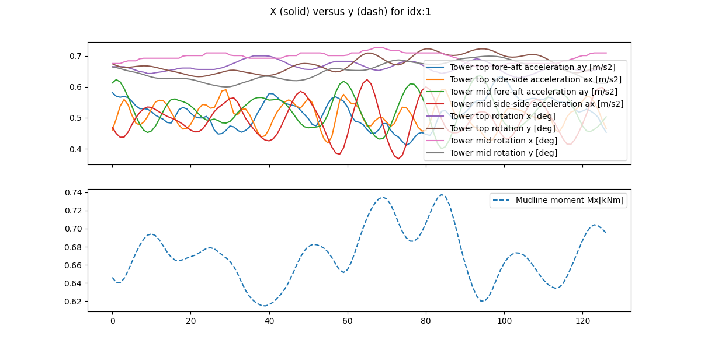

[](
    https://stringfixer.com/fr/MIT_license)
[](
        https://github.com/zwergon/wind_bench/actions/workflows/python-app.yml)


# Wind Bench

This repository contains a python module for testing different neural network architectures (CNN1D, LSTM, RNN, Resnet1D, Unet1D), which aim to estimate the temporal output of virtual force sensors from temporal signals from accelerometric sensors.

| 


# Quick start

### Installation for users

1. First create a python environment and activate it


```bash
python -m venv venv
. venv/bin/activate
```

2. Install the python module wb-virtual in it from git using the main branch.

```bash
pip install git+https://github.com/zwergon/wind_bench.git@main
```

3. use entry points defined in the package
    - `wb-train` to train a model
    - `wb-display` to display what kind of virtual sensing you are trying to do
    - `wb-predict` to make a prediction using a learned checkpoint

For that, you need to download a small dataset for testing purposes [wb_dataset.tar.gz](https://zwergon.github.io/datasets/wb_dataset.tar.gz).
Then unzip it somewhere, you o

```bash
ce where_to_extract
tar zxvf wb_dataset.tar.gz
```

you then have acces to a dataset `$where_to_extract/wb_dataset/wb/100_128/wind_bench.parquet`

You may visualize what you will train on this dataset using default paramater

```bash
wb-display $where_to_extract/wb_dataset/wb/100_128/wind_bench.parquet 1 -a
```

This will open a window that display the second item of the dataset (index = 1 and begin at 0) on a the whole time range (-a).
you should obtain a picture as the the one that follows where you can see on the plot on top the signals from whose a signle signal at bottom should be deduced:


Now you can launch a training process on this dataset

```bash
wb-train $where_to_extract/wb_dataset/wb/100_128/wind_bench.parquet
Type Network: LSTM
Device : cpu
matplotlib backend: agg, interactive: False
Name: indecisive-tern-241
Experiment_id: 749874395316112816
Artifact Location: file:///D:/lecomtje/Repositories/MPU/wb-virtual/mlruns/749874395316112816/4234c00e261a42a1b305f8af109055e7/artifacts
Signature inputs:
  [Tensor('float32', (-1, 8, 128))]
outputs:
  [Tensor('float32', (-1, 1, 128))]
params:
  None


Epoch 0/101 - Loss: train 0.439472, test 0.498611, lr 9.95e-05
Epoch 10/101 - Loss: train 0.006622, test 0.005991, lr 9.46e-05
Epoch 20/101 - Loss: train 0.004462, test 0.003206, lr 9.00e-05
Epoch 30/101 - Loss: train 0.003241, test 0.002547, lr 8.56e-05
Epoch 40/101 - Loss: train 0.002149, test 0.001605, lr 8.14e-05
Epoch 50/101 - Loss: train 0.001869, test 0.001497, lr 7.74e-05
Epoch 60/101 - Loss: train 0.001766, test 0.001517, lr 7.37e-05
...
```

you may want to follow your learning process by using [mlflow](https://mlflow.org/). 
We use this framework to store all results of the learning process. This is also where you will find the learned model at the end.

```bash
mlflow ui

```

then open a browser at [http://localhost:5000](http://127.0.0.1:5000), and the mlflow dashboard should appears. 
Look at the experience that is currently running (in our case `indecisive-tern-241`)

# Dataset format

[Format parquet](https://arrow.apache.org/docs/python/parquet.html) is absolutly well suited for such time series.
In order to build a efficient pytorch `Dataset`, we further use a partitioned Dataset. Partition key is by experiment id.
Each parquet file behind a directory `id=*` gives in an out signal as columns files gathered in a parquet file.

```
───wind_bench.parquet
    ├───id=Exp0.0
    │       4f08446266c142ef9a6b652f9aca2833-0.parquet
    ├───id=Exp0.1
    │       208a890929704b52b412a527735c36e3-0.parquet
    ├───id=Exp0.10
    │       287ef8f493d548ffa9a1be8d6bb2ec23-0.parquet
    ├───id=Exp0.11
    │       12221c7ce13f4c3a9dae5cf300016bc8-0.parquet
    ├───id=Exp0.12
    │       2273179532ff445d9e32a8e11c242d41-0.parquet
    ├───id=Exp0.13
    │       a2ca4d0dced341f4aba37c4824dfa27f-0.parquet
```


### Installation for developers

Install the module and dependencies in a virtual environment with Python 3.7-3.10.

```bash
pip install -e .
pip install -r requirements.txt
```

### Train on the test dataset

A small dataset is available by default in this repository. It contains 100
timeseries of size 128 samples. 

You can simply run a train on this dataset from root folder:

```bash
python scripts/virtual/train.py tests/data/100_128/wind_bench.parquet 
```

---

Date: 2023-12-17

Author: [github@zwergon](https://github.com/zwergon)

Copyright © 2022 Jean-François Lecomte

MIT License ([see here](LICENSE.md))

---