Introduction
============

Motivation
----------

The application of machine learning methods to predict dynamical systems
is increasing sharply. By their design, machine learning models offer
tremendous flexibility, capable of capturing complex behaviour and
patterns, while maintaining relatively tiny computational footprint (at
least once learned).

Modern wind turbines have multiple sensors installed and provide
constant data stream outputs; however, there are some important
quantities where installing physical sensors is either impractical or
the sensor technology is not sufficiently advanced. In such cases, real
sensors may be too expensive or too noisy in real conditions to be used
to provide measurements.

This is where “virtual sensors” come in. It’s a matter of defining a
model in the sense of machine learning, which will enable new signals
(virtual measurements) to be created on the basis of those we know or
can measure.

Problem description
-------------------

### Reference Turbine : IEA 15MW WIND TURBINE MODEL

Reference turbines are open-source designs of a complete wind power
system, including simulation and design models. In particular, they can
be used to evaluate the performance and cost of proposed modifications
prior to prototype development. NREL (USA) has released its latest 15MW
reference wind turbine.

The **IEA 15MW wind turbine** design is available for use by the wind
energy community in input files that support a variety of analysis
tools, including OpenFAST, HAWC2, WISDEM and HawtOpt2. In addition, the
data represented in the graphs and tables of the [report
](https://www.nrel.gov/docs/fy20osti/75698.pdf) detailing the wind
turbine specifications are also available in
[Excel](https://github.com/IEAWindTask37/IEA-15-240-RWT/tree/master/Documentation)
files.

This wind turbine is illustrated on this <a href='#fig:turbine:illustration'>figure</a>. The
figure also shows the positions of the sensors we have access to on the
turbine, and the positions of the sensors for which we want to predict
the output using machine learning. As inputs, we then have some
displacements or rotation measurements from whose bending moments need
to be predicted as output.

### Wind Energy Virtual Sensors Benchmark 

A crucial part of machine learning is to have access to a large amount
of high-quality data. Additionally, the data needs to be labelled in
order to perform supervised learning. This means we need a substantial
dataset that gives us access to both input and output data to enable our
algorithms to learn the dynamics our model needs to reproduce (our
*surrogate model*).

The IEA 15MW wind turbine gives access to OpenFast simulator. As a
result, it will be possible to define a synthetic response of the wind
turbine to different wind conditions.

In 2023, Nicolay Dimitrow, from DTU Wind and Energy Systems initiated a
benchmark which provides an open benchmarking dataset that can be used
for trying different virtual sensing approaches as well as for any other
study on loads and condition monitoring.

This means that an experimental design has been defined to sample
different operating points of the wind turbine by defining a certain
number of parameters.

A 7-D sample space with 6 environmental variables and one operational
(yaw misalignment) was sampled to provide environmental condition bounds
for load simulations. As an illustration, Fig.[fig:DoE~7~D~p~airplot]
illustrates how experimental space is sampled in the benchmark design.

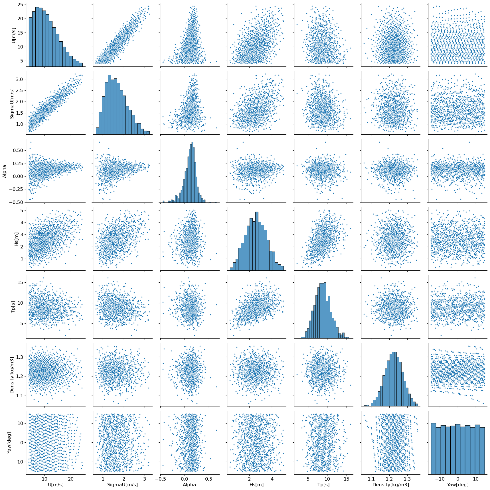
[fig:DoE~7~D~p~airplot]

Neural Networks
===============

To establish connections between the input signals and the signals
targeted for prediction, various types of neural networks were employed
in our approach, including convolutional neural networks (CNNs) and
recurrent neural networks (RNNs). The utilization of these neural
network architectures facilitates the extraction and understanding of
complex patterns within the data, contributing to the effectiveness of
the predictive model.In the subsequent sections, we will delve into a
detailed presentation of each neural network employed in our study.

Recurrent Neural Network
------------------------

Recurrent neural networks (RNN) are a class of deep learning models
designed to process sequential data. Unlike traditional neural networks,
RNN store previous information and use it to influence the processing of
new data.

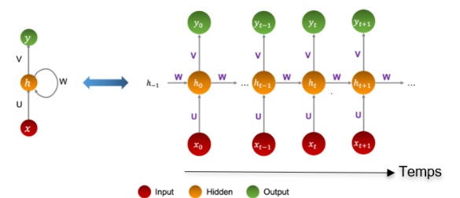

Long Short-Term Memory
----------------------

Long Short-Term Memory is a type of recurrent neural networks that was
created to bypass the vanishing gradient problem, a challenge that
arises during the training of traditional RNNs. A cell of LSTM network
is maindly composed to 3 parts:

-   **Forget Gate:** in this part of the cell, some information
    previously stored in memory is intentionally erased.This gate
    enables the LSTM to discard irrelevant or outdated information,
    allowing the network to focus on more relevant data.

-   **Input Gate:** This part of the LSTM cell is responsible for
    incorporating new information into the cell’s memory. The input gate
    regulates the flow of incoming information, determining which data
    is important to retain and add to the existing memory.

-   **Output Gate:** The output controls the flow of information that is
    passed on to the next layer of the neural network or that used as
    the final output.

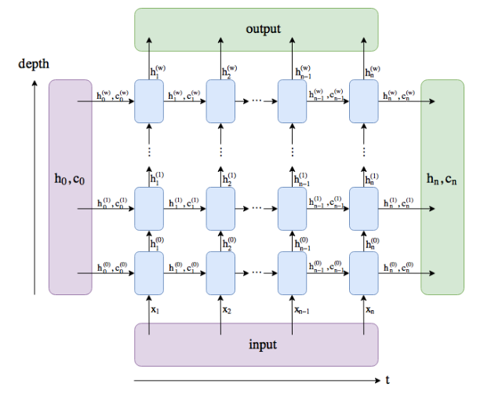

Convolutional Neural Network
----------------------------

Convolutional neural networks (CNNs) are a type of neural network
designed primarily for processing grid-structured data, such as images.
They use convolution layers to extract meaningful features, such as
contours and patterns, from input data. This approach allows CNNs to
capture local information while maintaining a certain hierarchy in the
extracted characteristics. Due to their ability to learn complex models
from spatial data, CNNs are commonly used in areas such as computer
vision for tasks such as image classification and object detection.

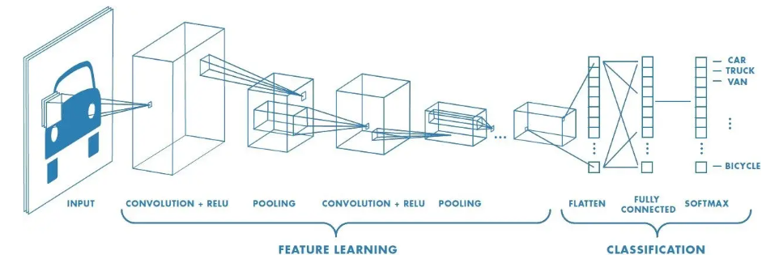

U-Net
-----

U-Net is a neural network architecture used primarily for image
segmentation. Its U-shaped structure incorporates an encoder to extract
features and a decoder to reconstruct the segmented image. Direct
connections between layers preserve contextual information, making it a
popular choice for accurate image segmentation.

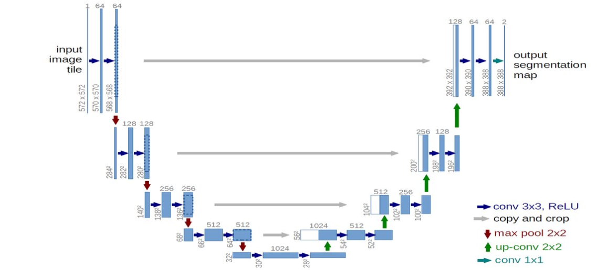

Data Processing
===============

As mentioned, DTU has provided a set of outputs supplied by `OpenFast`
using the wind data defined in paragraph <a href="#dtu:benchmark">benchmark</a>. One file can
be retrieved per experiment (one experiment per set of design
parameters). We therefore have 1000 files. These files are available
[here](https://www.zenodo.org/communities/wind-vs-benchmark/).

As output, each file provides 147 time series sampled at 100Hz over
700s. This gives us access to the wind speed at the center of the rotor,
as well as to certain accelerations measured at certain points on the
wind turbine, and also to forces and moments. These data, not normally
available in reality, will enable us to perform supervised learning. The
list of 147 signals supplied by DTU is provided in the appendix.

Sampling at 100Hz is too fast for the study we’re planning. We therefore
resampled the signals to 20Hz, first passing a low-pass filter to avoid
spectrum aliasing. In addition, to obtain signals that correspond to a
stationary regime, we removed the first 100 seconds, keeping only the
remaining 10 minutes (equivalent to the SCADA data sampling step).

This gives us an initial dataset of 1,000 experiments. In other words,
1000 files in parquet format. Each column in this file corresponds to
the last 10 minutes sampled at 20Hz from one of the 147 outputs provided
by OpenFast (i.e. 12,000 points per signal).

<a id="datastructure">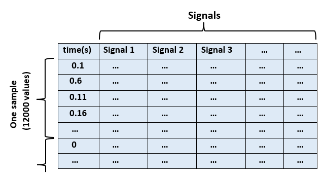</a>

The data structure is illustrated <a href="#datastructure">fig</a>

Input signals
-------------

For the prediction we use 8 signals at the inputs of networks. Theses
signals are as follows:

-   **Tower top fore-aft acceleration ay [m/s2]:** forward-backward
    acceleration measured at the top of the tower in meters per second.

-   **Tower top side-side acceleration ax [m/s2]:** lateral acceleration
    measured at the top of the tower in meters per second.

-   **Tower mid for-aft acceleration ay [m/s2]:** forward-backward
    acceleration measured at the mid-height of wind turbine tower,
    indicating the movement of the central part of the tower in wind
    direction.

-   **Tower mid side-side acceleration ax [m/s2]:** lateral acceleration
    measured at the mid-height of wind turbine tower, indicating the
    lateral movement of the central part of the tower.

-   **Tower top rotation x [deg]:** this measure represents the rotation
    around the horizontal axis at the top of the tower, expressed in
    degrees.

-   **Tower top rotation y [deg]:** this measure represents the rotation
    around the vertical axis at the top of the tower, expressed in
    degrees.

-   **Tower mid rotation x [deg]:** this measure represents the rotation
    around the horizontal axis at mid-height of the tower, expressed in
    degrees.

-   **Tower mid rotation y [deg]:** this measure represents the rotation
    around the vertical axis at mid-height of the tower, expressed in
    degrees.

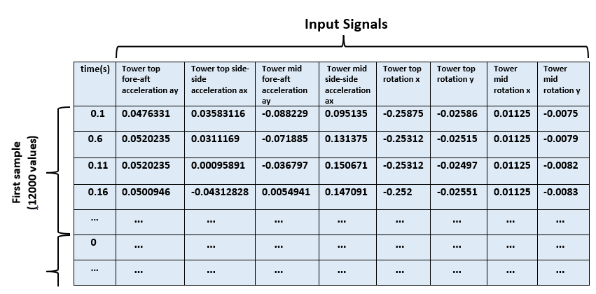

Target signals
--------------

From the 8 inputs signals presented in the previous section we will
predict 6 signals. The different signals. These signals are as follows:

-   **Mudline moment Mx[KNm]:** This is the moment around the axis X of
    mudline, expressed in kilonewton-meter.

-   **Mudline moment My[KNm]:** It’s the moment around the axis Y of
    mudline expressed in kilonewton-meter.

-   **Mudline moment Mz[KNm]:** This is the moment around the axis Z of
    mudline expressed in kilonewton-meter.

-   **Waterline moment Mx[KNm]:** This is the moment around the axis X
    of waterline, expressed in kilonewton-meter.

-   **Waterline moment My[KNm]:** This is the moment around the axis Y
    of waterline, expressed in kilonewton-meter.

-   **Waterline moment Mz[KNm]:** This is the moment around the axis Z
    of waterline, expressed in kilonewton-meter.

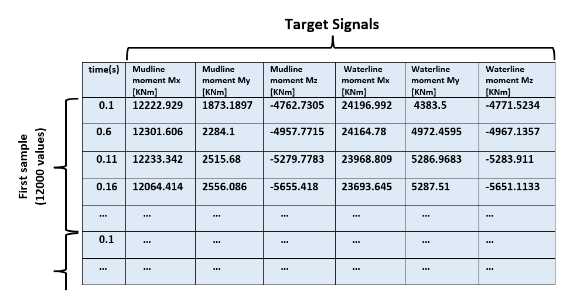

input and target Signals normalization
--------------------------------------

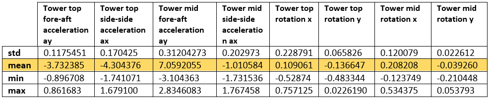

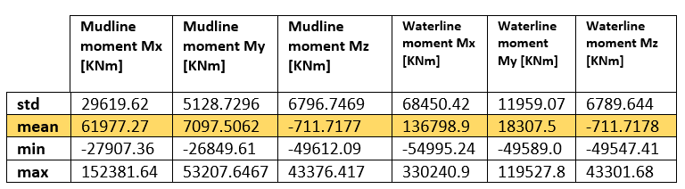

When we look at the statistical description of input and target signals
, we remark that the mean values are all different; some values are
close to 0 and others exceed 10000. The signals are of different scales,
which may be a problem for the neural network, so it is necessary to
normalize them. The normalization method consists in applying the
following formula on each signal:

$$\begin{aligned}
x_{ij}^{(normalize)}=\frac{x_{ij}-x_{j}^{(min)}}{x_{j}^{(max)}-x_{j}^{(min)}} \\\end{aligned}$$

with $x_{ij}$ the i-th value of the j-th signal, $x_{j}^{(max)}$ the
highest value of the j-th signal and $x_{j}^{(min)}$ the smallest value
of the j-th signal.

Dataset balance
---------------

After standardizing the data, it is divided into training and test data.
90% of the data will be used for training and the remaining 10% for
testing. In the figure below, the signals are represented two by two for
the drive and test sets. The observation of the figure reveals that the
test data are located in the training data region, thus emphasizing the
consistency between the two sets. This approach makes it possible to
evaluate the model’s ability to generalize data not used during
training, thus contributing to evaluate its performance on unpublished
data.

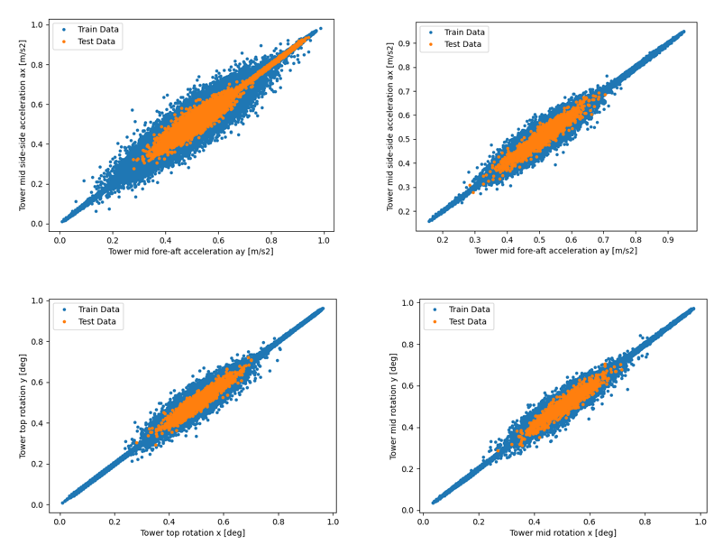

Network structures
==================

After data processing, the next phase involves the development of
models. The initial step is to determine the loss function and
appropriate regression measurements. This involves selecting the error
function that the network will aim to minimize and specifying the
metrics used to evaluate and compare the performance of different
networks. Once this is done, the structure of different neural networks
and the hyperparameters of these networks must be chosen in the case of
the prediction of target signals one by one and in the case of the
prediction of six target signals together.

Loss function and Regression metrics
------------------------------------

The loss function that the different neural networks will try to
minimize is **the Means Square Error** (MSE). MSE is calculated by
taking the mean of the squares of the differences between the values
predicted by the model and the actual values. The mathematical formula
of the MSE for a dataset of size $n$ is as follows:

$$\begin{aligned}
MSE=\frac{\sum_{i=1}^{n}(y_{i}-\hat{y}_{i})^2}{n}\end{aligned}$$

Selection of Hyperparameters and functions
------------------------------------------

- utilisation de ray tune pour trouver le learning rate et le weight
decay - parler de General Parameters and functions ( ne pas oublier de
parler des samples)

Final Network Structures
------------------------

Cas de la prédiction des signaux( 1 à 1)\
- LSTM CNN CNN-LSTM U-Net\
Cas de la prédiction des 6 signaux ensembles\
- LSTM CNN CNN-LSTM U-net\

Results
=======

Conclusion
==========
